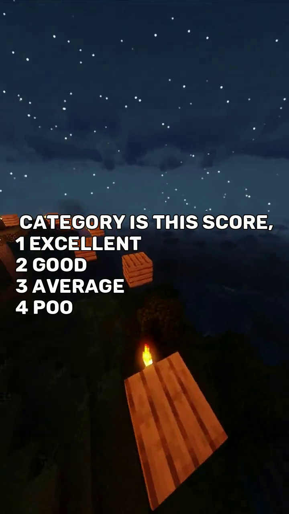

# 🚀 Reddit Story to Video Generator 📹

Turn your favorite Reddit posts into engaging video clips! This tool fetches Reddit stories, converts the text into speech, and combines it with captivating visuals, all automated to produce shareable videos.


## 📋 Project Overview

This project automates the process of transforming a Reddit post into a video by:
- Fetching stories using the Reddit API.
- Converting text content to speech using Eleven Labs' API.
- Combining the audio with visual backgrounds and subtitles.
- Generating a video with a stylish look, suitable for platforms like TikTok, Instagram, or YouTube Shorts.

## ✨ Features

- **Reddit Story Fetcher**: Automatically pulls stories from a specified Reddit post.
- **Text-to-Speech Conversion**: Uses advanced TTS to convert text to natural-sounding audio.
- **Video Synthesis**: Combines audio with video backgrounds and dynamic captions.
- **Customizable Output**: Easy to modify fonts, styles, and templates.

## 🔧 Installation

### Prerequisites

- Node.js
- Python 3.x
- ffmpeg (for video processing)
- Eleven Labs API key (for TTS)

### Step-by-Step Guide

1. **Clone the repository**:
    ```bash
    git clone https://github.com/yourusername/reddit-story-to-video-generator.git
    cd reddit-story-to-video-generator
    ```

2. **Install Node.js dependencies**:
    ```bash
    npm install
    ```

3. **Install Python dependencies**:
    ```bash
    pip install -r requirements.txt
    ```

4. **Configure API Keys**:
   - Create a `.env` file in the root directory.
   - Add your Eleven Labs API key and Reddit credentials:
     ```
     ELEVENLABS_API_KEY=your_api_key
     REDDIT_CLIENT_ID=your_client_id
     REDDIT_CLIENT_SECRET=your_client_secret
     ```

5. **Run the Application**:
   - To start the backend server:
     ```bash
     node server.js
     ```
   - To run the Python script:
     ```bash
     python reddit.py
     ```

## 🎬 Demo Video

[](https://youtube.com/shorts/iwBzLQjRW6w?si=rEG8pfOyfWALmf23)

## 🖼️ Screenshots

### 1. User Interface


### 2. Generated Video Output


## 🛠️ Technologies Used

- **Backend**: Node.js, Express
- **Frontend**: HTML, TailwindCSS
- **Python**: praw, OpenCV, moviepy
- **Video Processing**: ffmpeg, PIL (Pillow)
- **Text-to-Speech**: Eleven Labs API

## 🤝 Contributing

1. Fork the repository.
2. Create your feature branch: `git checkout -b feature-name`.
3. Commit your changes: `git commit -m 'Add feature'`.
4. Push to the branch: `git push origin feature-name`.
5. Open a pull request.

## 📜 License

This project is licensed under the MIT License. See the [LICENSE](LICENSE) file for details.

## 🌟 Acknowledgements

- Thanks to [Eleven Labs](https://elevenlabs.io) for their fantastic TTS service.
- Reddit community for the amazing stories and content.
- Open-source libraries that make this project possible.
